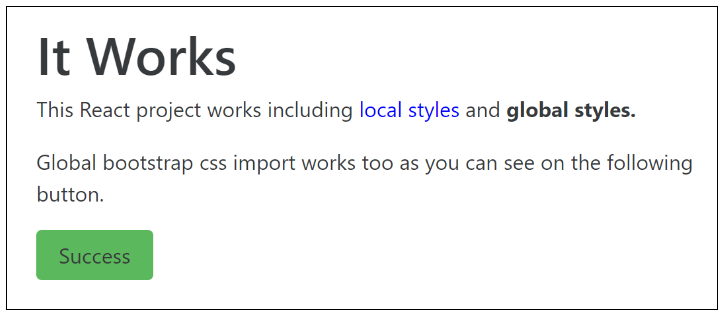
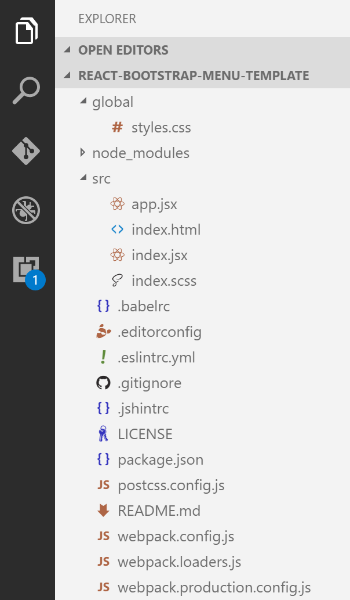
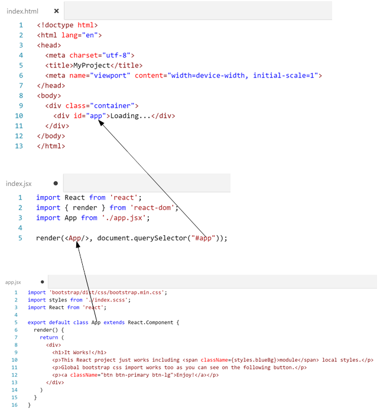
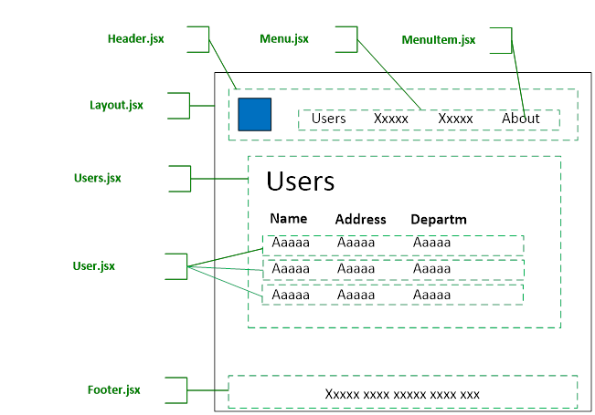
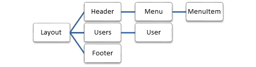
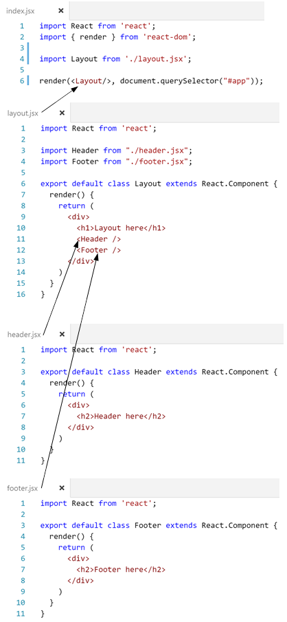
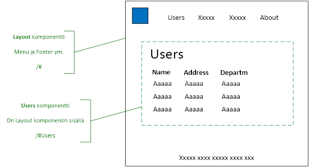

ReactJS - Perusteet 
===================

Yleistä
-------

React on Facebook:in kehittämä käyttöliittymien toteutukseen tarkoitettu Javascript kirjasto. MVC mallin näkökulmasta React toteuttaa vain View-kerroksen. React on yksinkertaisempi ja nopeammin opittavissa kuin esim. Angular.

React käyttöliittymän nopeus perustuu ns. virtuaaliseen DOM:in. Käytännössä muutokset tehdään ensin virtual DOM:iin ja React päivittää ne tarvittaessa taustalla selaimen DOM:in.

React toteutusten rakenne perustuu kokonaisuuden jakoon useisiin pieniin komponentteihin, jotka ovat toisistaan riippumattomia ja tarvittavat tiedot injektoidaan ylemmän tason komponenteista alenpiin.

Javascript koodi on yleensä JSX ja ES6 muotoista, jonka Babel-komponentti muokkaa taustalla selainten tukemaan vanhempaan JS/ES5 muotoon.

React käyttää taustaprosesseissa ja komponenteissa NodeJS kirjastoa.

Lisätietoja: <https://facebook.github.io/react/>

Kehitysympäristö
----------------

React kehitystä voi tehdä periaatteessa kaikilla yleisimmillä IDE:llä. MS:n tarjoamista vaihtoehdoista VS Code on tällä hetkellä paras, sillä se tukee Javascript kehitystä paremmin kuin Visual Studio. Kehitystä voi tehdä myös OSX tai Linux ympäristöissä.

Visual Studio ympäristössä esim. ASP.Net MVC projektiin on mahdollista sisällyttää React komponentteja **ReactJS.Net** kirjastojen avulla, mutta ne eivät sisällä mm. Import-Export toiminnollisuuksia, jotka ovat tarpeellisia rakenteellisesti hajautettujen eli useista moduuleista koostuvien React-järjestelmien kehityksessä.

Visual Studio + ReactJS.Net sopii pienten järjestelmien kehitykseen sekä toteutuksiin, joissa on sekaisin ASP.Net komponentteja ja React-komponentteja.

Asennus
=======

Pakolliset ohjelmistot
----------------------

-   Asenna **uusin** NodeJS, jos sitä ei ole jo asennettuna

    -   <https://nodejs.org/en/download>

-   Asenna command line Git, jos sitä ei ole jo asennettuna

    -   <https://git-scm.com/download/win>

-   Asenna kehitysympäristö esim. VS Code, jos sitä ei ole jo asennettuna

    -   <https://code.visualstudio.com/download>

Uuden React projektin aloitus
-----------------------------

### React, Babel ja Webpack asennus

React kehityksessä tarvitaan React kirjastojen ja Babelin lisäksi Javascript bundler, joista yleisimmin käytetään on Webpack:ia. Tämän lisäksi tarvitaan web server, yleensä Webpack dev server. Nämä asennetaan samasta templatesta seuraavasti

-   Lisää tarvittaessa uusi kansio VS Code projekteille esim. \\My Documents\\VS Code Projects

-   Avaa command prompt tässä kansiossa

-   Asenna React projekti-template, joka sisältää tarvittavat React, Babel ja Webpack komponentit

    -   Muuta `my-project-name` tilalle projektin nimi, esim. react-training

```
> git clone https://github.com/nsdnwe/react-webpack-babel-template my-project-name
```

-   Käynnistä komponenttien asennus

```
> cd my-project-name
> npm install
```
-   Käynnistä Babel, Webpack bundler ja Webpack dev server

```
> npm start
```

-   Jätä command prompt auki

-   Siirry web-sivulle avaamalla selaimeen [**http://localhost:8888**](http://localhost:8888)

-   Selaimena suosittelen käyttämään Chromea, jossa on erinomaiset debug-ominaisuudet

-   Sivun pitäisi näyttää tältä



-   Mikäli portti 8888 on jo käytössä, voit vaihtaa porttia muuttamalla PORT-määritystä webpack.config.js tiedostossa

-   Paina **F12** ja valitse Console, jotta näet mahdolliset virheilmoitukset Chromessa

Lisää React templateja on esim. osoitteessa: <http://andrewhfarmer.com/starter-project/>

ES6 lyhyesti
============

Seuraavissa kappaleissa on muutamia myöhemmin käytettäviä muutoksia verrattuna ES5 syntaksiin. Katso lisätietoja: <http://es6-features.org>

Muuttujien esittely
-------------------

**var** tyyppisten muuttujien lisäksi ovat uusina muuttujatyyppeinä

-   **const** Constant, jota ei voi muuttaa määrityksen jälkeen

-   **let** Scopen sisäinen muuttuja, ei siis näy scopen ulkopuolelle

Arrow functions (lambdas)
-------------------------

ES5 `function() {}` syntaksi voidaan kirjoittaa hieman lyhyemmin arrow function syntaksilla.

**Esim 1**

```javascript
setTimeout(() => console.log('Done'), 2000)
```

on sama kuin ES5
```javascript

setTimeout(function() {
  console.log('Done')
  }, 2000
)
```

**Esim 2**

```javascript
const books = [
  {name: 'Nimi-1'},
  {name: 'Nimi-2'},
  {name: 'Nimi-3'},
]
books.forEach(b => console.log(b.name))
```

Desctructor
-----------

Objekti voidaan hajottaa muuttujiin desctructor metodilla. Esim.

```javascript
const myObj = {name: 'Bill', age: 45}
const {name, age} = myObj
console.log(name)
```

Luokat
------

Luokat eivät ole täysin samoja kuin oikeissa OOP kielissä mutta ES6 mahdollistaa saman tyyppiset toiminnot. Esim.

```javascript
class MyClass {
  constructor(x) {
    console.log('Class constructor')
    this.z = x
  }

  MyMethod(y) {
    console.log('Class method')
    console.log(this.z * y)
  }
}

var myObj = new MyClass(5)
myObj.MyMethod(7)
```

Modulit
-------

Javascript luokat ja metodit voi tallentaa erillisiin moduli-tiedostoihin, joita on mahdollista ottaa käyttöön muissa moduleissa import-toiminnon kautta.

Esim. MyClass.js

```javascript
export default class MyClass {
  constructor(x) {
    console.log('Class constructor')
    this.z = x
  }

  MyMethod(y) {
    console.log('Class method')
    console.log(this.z \* y)
  }
}
```

Esim. kutsu

```javascript
import MyClass from './MyClass.jsx'
var myObj = new MyClass(8)
myObj.MyMethod(7)
```

React projektin rakenne
=======================

react-webpack-babel-template oletushakemistopuun



-   index.html

    -   Html-sivu, joka ladataan ensimmäisenä

-   index.jsx

    -   Ylimmän tason React komponentti

    -   Sisältää Routing tiedot, mikäli Routing on käytössä

-   app.jsx

    -   Esimerkkikomponentti (etusivu), jota index.jsx kutsuu

-   global-kansio

    -   globaalit CSS-tiedostot



Käännös
-------

-   Muutosten talletuksen jälkeen Webpack tekee taustaprosessina käännöksen, jossa eri JSX (ja JS) tiedostot minimoidaan ja optimoidaan yhteen JS tiedostoon ES5 muodossa

-   Kehitysympäristössä käännetty sisältö siirretään muistinvaraisesti suoraan selaimeen ja selainikkuna päivittyy automaattisesti

Rakenne
-------

-   React sivustot koostuvat monista yleensä pienistä komponenteista

-   Komponentit ovat toisistaan riippumattomia ja tarvittavat tiedot injektoidaan ylemmän tason komponenteista alenpiin

-   Komponentit ovat uudelleen käytettäviä ja ”loosely coupled”

Esimerkkisivu ja sen komponentit
--------------------------------



**Hierarkiana**



**Esimerkkikoodina, vain header ja footer**



React komponentin metodit ja eventit
=========================

render() 
---------

-   React komponentti sisältää aina `render()` metodin, jonka tulee palauttaa yksi elementti, esim. `<div></div>`. Tämän elementin sisällä on yleensä useita muita elementtejä

-   Rakenne on JSX formaatin mukaista eli HTML on mukana Javascriptissa

-   `render()` suoritetaan aina uudestaan, kun sen sisällä olevat muuttujat muuttuvat. Tästä lisää myöhemmin

constructor()
-------------

-   Suoritetaan vain kun komponentti ladataan ensimmäisen kerran

-   Muista kutsua `super()` metodia metodin alussa

componentDidMount()
-------------------

-   Suoritetaan, kun `render()` on suoritettu loppuun ja DOM on lataantunut

-   Käytetään yleensä mikäli tulee varmistaa, että DOM elementit ovat olemassa, jotta niihin voi viitata

-   `componentDidMount()` suoritetaan uudestaan, kun `render()` metodin sisällä oleva DOM-rakenne muuttuu

-   Esim.

```javascript
import React from 'react'
export default class App extends React.Component {
  constructor() {
    super()
    console.log('Constructed')
  }
  componentDidMount() {
    console.log('Mounted')
  }
  render() {
    console.log('Render')
    return (<div><h1>It Works</h1></div>)
  }
}
```

Props
=====

-   Moduulien välillä tieto siirretään Props:ien avulla

-   Esim. Layout.jsx

```javascript
import React from 'react'
import User from './user'
export default class Layout extends React.Component {
  render() {
    return (
      <div>
        <User name = "Bill" age = {45} />
      </div>
    )
  }
}
```

-   User.jsx

```javascript
import React from 'react'
export default class User extends React.Component {
  render() {
    const {name, age} = this.props
    return (
      <div>
        <h3>Good morning {name} age {age}</h3>
      </div>
    )
  }
}
```

tai

```javascript
<h3>Good morning {this.props.name} age {this.props.age}</h3>
```

-   Muut kuin string tyyppiset Propertyt tulee merkitä kutsussa kaarisulkujen sisään

-   ES6 destructoria kannattaa käyttää selkiyttämään koodia, mikäli props:eja on paljon

Spread operator
---------------

-   Luokan voi purkaa properteiksi **spread operatorilla** eli kolmella pisteellä … Esim.

```javascript
const myObject = { name: "Bill", age: 45 }
return (
  <div>
    <User {...myObject} />
  </div>
)
```

Eventit
=======

-   Eventit tulee aina bindata kyseiseen komponenttiin `.bind()` metodilla ja kaarisuluilla

-   Esim. User.jsx

```javascript
import React from 'react'
export default class User extends React.Component {
  myEvent(e) {
    console.log( e.target.value )
  }
  render() {
    const {name, age} = this.props
    return (
      <div>
        <h3>Good morning {name} age {age}</h3>
        <input onChange={ this.myEvent.bind(this) } />
      </div>
    )
  }
}
```

Komponenttien väliset eventit
-----------------------------

-   Viittaus toisen komponentin metodiin voidaan upottaa props määrittelyn kautta alempiin komponentteihin samalla tavoin kuin muutkin props:it

-   Esim. User.jsx

```javascript
import React from 'react'
import UserGreeting from './UserGreeting'
export default class User extends React.Component {
  doGreeting(greetingText) {
    console.log(greetingText)
  }
  render() {
    const {name, age} = this.props
    return (
      <div>
        <h3>{name} age {age}</h3>
        <UserGreeting myGreeting={this.doGreeting.bind(this)}/>
      </div>
    )
  }
}
```

-   UserGreeting.jsx

```javascript
import React from 'react'
export default class UserGreeting extends React.Component {
  inputEvent(e) {
    this.props.myGreeting(e.target.value)
  }
  render() {
    return (
      <div>
        <input onChange={ this.inputEvent.bind(this) } />
      </div>
    )
  }
}
```

State
=====

-   Komponenttien tilojen ja tietojen hallintaan käytetään state-objektia

-   Kun state muuttuu, React päivittää automaattisesti ne kohdat sivun DOM:issa, joihin muutos vaikuttaa

-   State-objektin oletusarvot määritetään yleensä `constructor()` metodissa

-   Myöhemmin state:n tilaa voi muuttaa `setState()` metodilla

-   Esim. User.jsx

```javascript
import React from 'react'
export default class User extends React.Component {
  constructor() {
    super()
    this.state = { greeting : "Good morning" }
  }
  inputEvent(e) {
    this.setState({ greeting : e.target.value })
  }
  render() {
    return (
      <div>
        <h3>{ this.state.greeting }</h3>
        <input defaultValue={ this.state.greeting } onChange={ this.inputEvent.bind(this) } />
      </div>
    )
  }
}
```

Rest kutsut
===========

-   Rest objektien haku ja lähetys tapahtuu esim. jQuery:n avulla

-   Toinen hyvä vaihtoehto on `fetch()` metodi, jolloin jQuery ei ole tarpeellinen

-   Mikäli jQuery ei ole lisätty globalisti index.html tiedostossa, sen voi ottaa modulikohtaisesti käyttöön

```javascript
import $ from 'jquery'
```

Get esimerkki
-------------

```javascript
import React from 'react'
import $ from 'jquery'
export default class Books extends React.Component {
  constructor() {
    super()
    // Id 0 = Get only the last book on the list
    const url = 'http://NsdBooksTrainingApi.azurewebsites.net/Api/Books/0'
    $.getJSON(url).done(data => console.log(data))
  }
  render() {
    return (
      <div><h1>Get sample</h1></div>
    )
  }
}
```

Post esimerkki
--------------

```javascript
import React from 'react'
import $ from 'jquery'
export default class Books extends React.Component {
  constructor() {
    super()
    this.postData() // Add a new book every time page is loaded
  }
  postData() {
    const url = 'http://NsdBooksTrainingApi.azurewebsites.net/Api/Books'
    const newBook = { name: 'Book1', author: 'Author1', description: 'Desc1' }
    $.ajax({
      url,
      data: JSON.stringify(newBook),
      type: 'POST',
      dataType: 'json',
      contentType: 'application/json',
      timeout: 15000 // 15s
    })
    .done((data, status, headers, config) => console.log('New book', data))
    .fail((data, status, headers, config) => console.error(data))
  }
  render() {
    return (
      <div><h1>Post sample</h1></div>
    )
  }
}
```

Komponenttilistat
=================

-   Mikäli JSX koodissa kutsutaan komponenttilistaa, React listaa komponentit automaattisesti silmukassa

-   Komponenttilista kannattaa muodostaa `.map()` metodilla

-   Käytä komponenttilistan kutsussa kaarisulkuja, ei < />

-   Esim. Books.jsx

```javascript
import React from 'react'
import Book from './book'
import $ from 'jquery'
export default class Books extends React.Component {
  constructor() {
    super()
    this.state = { bookList: [] }
    const url = 'http://NsdBooksTrainingApi.azurewebsites.net/Api/Books'
    $.getJSON(url).done(data => this.setState({ bookList: data }))
  }
  render() {
    const books = this.state.bookList.map(
      (book) => <Book key = {book.id} {...book} />
    )
    return (
      <div>{books}</div>
    )
  }
}
```

-   Esim. Book.jsx

```javascript
import React from 'react'
export default class Book extends React.Component {
  render() {
    const {bookName, author, description} = this.props
    return (
      <div>{bookName} {author} {description} </div>
    )
  }
}
```

Tyyliluokat
===========

CDN tyylien käyttö
------------------

-   Lisää linkki index.html tiedostoon head-elementtiin. Esim.

```javascript
<link rel="stylesheet" href="https://maxcdn.bootstrapcdn.com/bootstrap/3.3.7/css/bootstrap.min.css" />
```

-   Kun muutat index.html tiedostoa, **päivitä** selain painamalla F5

Globaalit CSS tiedostot
-----------------------

-   Globaaleja tyylitiedostoja varten tulee luoda projektikansion alle uusi kansio **global** ja tallentaa tyylitiedostot sinne

-   Lisää app.jsx moduliin tyylitiedoston import. Esim.

```javascript
import '../global/styles.css'
```

-   Tämän jälkeen tyylejä voi liittää HTML-elementteihin `className` attribuutilla. Esim.

```javascript
<span className="my-style">Works</span>
```

Paikalliset SCSS, LESS, SASS ym. tyylilajikielet
------------------------------------------------

-   react-webpack-babel-template sisältää määritykset SCSS tyylien käytölle

-   Mikäli haluat käyttää Webpack käännöksessä muita tyylilajikieliä, lisää näiden määritykset **webpack.config.js** tiedostoon

-   Mikäli käytät SCSS tyylitiedostoja, lisää app.jsx moduliin index.scss tiedoston import. Esim.

```javascript
import Styles from './index.scss'
```

-   Tämän jälkeen tyylejä voi liittää elementteihin `className` attribuutilla. Esim.

```javascript
<span className={Styles.blueBg}>Works</span>
```

Usean luokan käyttö tyylimäärityksessä
--------------------------------------

-   Mikäli käytät globaaleja CSS-tyylejä, voi className-attribuutti sisältää useita tyylejä. Esim

```javascript
<span className="panel special-panel-style my-style">My panel</span>
```

-   Mikäli käytät edellisessä kappaleessa kuvattuja paikallisia SCSS-tyylejä, voi yhteen className-attribuuttiin liittää vain yhden tyyliluokan

-   Mikäli haluat käyttää useita tyyliluokkia samassa `className` attribuutissa, asenna **classnames** komponentti, eli suorita command prompt tilassa

```
> npm install classnames –save
> npm start
```

-   Esim.

```javascript
import ClassNames from 'classnames'
import Styles from './index.scss'
<span className={ClassNames(Styles.blueBg, Styles.redBox)}> Works</span>
```

React-html-attrs
----------------

-   Koska `class` on ES6:ssa varattu sana, sitä ei voi käyttää JSX elementeissä vaan tulisi käyttää sanaa `className`

-   Jotta olemassa olevia koodi snippettejä ei tarvitse muokata, voi ottaa käyttöön react-html-attrs, joka mahdollistaa `class` sanan käytön

-   Avaa VS Codessa .babelrc tiedosto ja lisää plugins rivi

```
{
  "presets": ["es2015", "react"],
  "plugins": [ "react-html-attrs" ]
}
```

-   Suorita command prompt tilassa

```
> npm install -S babel-plugin-react-html-attrs
> npm start
```

Style attribuutit
=================

Elementin sisäinen style määritys
---------------------------------

-   Stylen voi määrittää HTML-elementin sisällä käyttämällä kaksia kaarisulkuja. Esim.

```javascript
<span style={{color: 'blue', fontWeight: 'bold'}}>Works</span>
```

-   Style notaatio poikkeaa hieman CSS-tiedostojen notaatiosta, eli viiva on korvattu camelCasing:llä

    -   Esim. `fontWeight` ei `font-weight`

-   Attribuutin **arvo** tulee ympäröidä heittomerkeillä

    -   Esim. `'blue'` tai `'20px'`

-   Tyyleissä voi käyttää myös ehtolauseita. Esim.

```javascript
render() {
  const isBlue = true
  return (
    <div>
      <span style={isBlue ? {color: 'blue'}: {color: 'red'}}>Works</span>
    </div>
  )
}
```

Ohjelmallinen tyylien määritys
------------------------------

Tavoitteena React komponenttien kehityksessä on toteuttaa itsenäisiä kokonaisuuksia, joilla ei ole riippuvuuksia ylemmän tason komponentteihin tai globaaleihin objekteihin kuten globaaleihin CSS-tiedostoihin. Tästä syystä osa React ohjelmoijista suosii ohjelmallisia tyylimäärityksiä (inline styles) globaalien CSS, SCSS ym. tiedostojen sijaan. Kummallakin ratkaisulla on tietyt edut ja haitat.

-   Esim.

```javascript
render() {
  const myStyle = {
    color: 'red',
    fontWeight: 'bold'
  }
  return (
    <div><span style={{myStyle}}>Works</span></div>
  )
}
```

Bootstrap 
==========

Bootstrap template
------------------

Helpoin tapa ottaa Bootstrap käyttöön projektin alkuvaiheessa, on kloonata valmis template, joka sisältää Bootstrap:in. Esim.

```
> git clone https://github.com/nsdnwe/react-webpack-babel-bootstrap-menu-template my-project-name
```

Kevyt asennus eli vain css 
---------------------------

-   Lisää index.html tiedoston <head> elementtiin

```javascript
<link href="https://maxcdn.bootstrapcdn.com/bootstrap/3.3.7/css/bootstrap.min.css" rel="stylesheet" />
```

tai

```javascript
<link href="https://maxcdn.bootstrapcdn.com/bootswatch/3.3.7/cerulean/bootstrap.min.css" rel="stylesheet" />
```

-   Alempi vaihtoehto käyttää Bootswatch templatea, joiden mallit ovat osoitteessa <https://bootswatch.com>


Syöttöformit
============

-   Syöttökenttiin syötettävän tiedon voi lukea ”submit” vaiheessa käymällä läpi kaikki syöttökentät esim.

```javascript
var author = ReactDOM.findDOMNode(this.refs.author).value
```

tai

-   Suositeltava tapa on kuitenkin siirtää tieto suoraan state objektiin sitä mukaa kun syöttökenttien tieto muuttuu ja ”submit” vaiheessa tallentaa state objekti tai state objektin sisälle tehty esim. data niminen objekti

-   Esim.

```javascript
import React from 'react'
export default class EditBook extends React.Component {
  constants() {
    return {'URL': 'http://NsdBooksTrainingApi.azurewebsites.net/Api/Books/'}
  }
  constructor(props) {
    super(props)
    this.state = { id: 0, name: "", author: "", description: "" }
    // "0" -> Get the last added book
    $.getJSON(this.constants().URL + "0").done(data => this.setState(data))
  }
  postData() {
    $.ajax({
      url: this.constants().URL,
      type: "POST",
      data: JSON.stringify(this.state),
      dataType: "json",
      contentType: "application/json"
    })
    .done((data) => console.log('Saved with new id ' + data.id))
  }

  render() {
    const {name, author, description} = this.state
    var panelStyle = {width: '300px'}
    var controlStyle = {marginBottom: '5px'}
    return (
      <div>
        <div className="panel panel-primary" style={panelStyle}>
          <div className="panel-heading">
            <h2 className="panel-title">Add new book</h2>
          </div>
          <div className="panel-body">
            <input autoFocus placeholder="Book name" className="form-control" style={controlStyle} defaultValue={name} onChange={(me) => this.setState({name: me.target.value})}></input>
            <input placeholder="Author" className="form-control" style={controlStyle} defaultValue={author} onChange={(me) => this.setState({author: me.target.value})}></input>
            <input placeholder="Description" className="form-control" style={controlStyle} defaultValue={description} onChange={(me) => this.setState({description: me.target.value})}></input>
            <button className="btn btn-primary btn-block" style={controlStyle} onClick={ this.postData.bind(this) }>OK</button>
          </div>
        </div>
      </div>
    )
  }
}
```

Routing
=======

Asennus (Versio 3)
-------

-   Asenna React router ja React history

```
> npm install -S react-router
> npm install -S history
> npm start
```

Periaate
--------

-   Routing koostuu yleensä sisäkkäisistä Route elementeistä. Esim.

    -   Ylin taso: Layout

        -   Sivun ulkoasu ja ”pysyvät” osat kuten esim. menu ja footer

        -   Vtr. MVC: \_Layout.cshtml

    -   Ylimmän tason sisällä ovat varsinaiset sivut

        -   Esim. Users, About, Books, Edit book jne.



-   Routing rakenne määritetään index.jsx modulissa esim.

```javascript
import React from 'react'
import { render } from 'react-dom'
import { Router, Route, IndexRoute, browserHistory } from 'react-router'
import Layout from './pages/Layout'
import Users from './pages/Users'
import About from './pages/About'

render(
  <Router history={browserHistory}>
    <Route path="/" component={Layout} >
      <IndexRoute component={About} />
      <Route path="/Users" component={Users} />
    </Route>
  </Router>,
  document.getElementById('App')
)
```

-   IndexRoute on oletus route (Default route), joka tuodaan mikäli mitään muuta routea ei ole URL:issa määritettynä eli kun URL on vain osoite tai osoite+/\#

-   Routing rakenteen ylimmän tason Route siis tuodaan aina, eli esimerkissä Layout komponentti ja sen ”sisälle” URL:ssa valittu alemman tason route. Esim.

    -   Mikäli URL on /\#Users, tuodaan sisälle Users komponentti

    -   Mikäli URL on /\#, tuodaan sisälle oletus route eli About komponentti

-   Kohta, johon Layout komponentissa alemman tason komponentti tuodaa, määritetään rivillä `{this.props.children}`

-   Esim. Layout.jsx

```javascript
import React from "react"
export default class Layout extends React.Component {
  render() {
    return (
      <div>
        <h1>Sample layout page</h1>
        {this.props.children}
      </div>
    )
  }
}
```

Linkit
------

-   `<a href=` tyyppisiä linkkejä ei tulisi käyttää vaan Reactin `<Link>` tagia

-   Esim. Layout.jsx

```javascript
import React from "react"
import { Link, IndexLink, browserHistory } from "react-router"
export default class Layout extends React.Component {
  myNavigate() {
    browserHistory.push("/")
  }
  render() {
    return (
      <div>
        <h1>Sample layout page</h1>
        <Link to="/Users">Users</Link> &nbsp
        <Link to="/"><button>About</button></Link> &nbsp
        <button onClick={this.myNavigate.bind(this)}>About</button>
        {this.props.children}
      </div>
    )
  }
}
```

-   Pelkkä `<Link to..` tag tuo linkin kyseiseen routeen

-   Mikäli `<Link to..` tagin sisällä on esim. Button, muuttuu linkki painikkeeksi

-   Routen voi vaihtaa myös ohjelmallisesti `browserHistory.push()` metodilla

URL parametrit ja query string 
-------------------------------

-   Routen voi sisällyttää parametrejä lisäämällä kaksoispisteen ja parametrin nimen. Mikäli parametrin ympärillä on sulut, se on ei-pakollinen. Esim. index.jsx

```javascript
<Route path="/Project(/:id)" component={Project} />
```

-   Linkki on tällöin esim. joko muotoa (Layout.jsx)

```javascript
<Link to="/Project/abc?page=1">Project</Link>
```

tai

```javascript
<Link to={{ pathname: '/Project/abc', query: { page: '1' } }} />
```

-   Esim. Project.jsx

```javascript
import React from "react"
export default class Project extends React.Component {
  render() {
    const { page } = this.props.location.query // Query str
    const { id } = this.props.params // Url param
    return (
      <div>
        <h2>Now page is: Project id {id}, page {page}</h2>
      </div>
    )
  }
}
```

-   Suositeltavaa on käyttää querystring parametrejä

-   Mikäli käytät url parametrejä, suositeltavaa on käyttää index.jsx tiedostossa `<Router history={browserHistory}>` tilalla `<Router history={hashHistory}>`

Muuta
=====

Kuvat
-----

Yksinkertaisin tapa liittää kuvia React-Webpack projektiin

-   Lisää src kansion alle kuvakansion. Esim.

```
    \src\images
```

-   Lisää kuvat kansioon

-   Lisää viittaukset kuviin. Esim.

```javascript

```

JSX – IF
--------

JSX koodiin voi liittää ehtolauseita esim.

```javascript
render() {
  return (
    <div>
      {this.state.myValue ? <MyComponent /> : <MyOtherComponent /> }
    </div>
  )
}
```

VS Code tricks
==============

Yleistä
-------

Näytön värien vaihto esim. Visual Studio tyylisiksi

-   Valitse menusta: File, Preferences, Color Theme

Ikonit tiedostopuuhun

-   Valitse menusta: File, Preferences, File Icon Theme

Save All Changes shortcut lisäys (=Ctrl+Shift+S)

-   Valitse menusta: File, Preferences, Keyboard Shortcuts

-   Lisää oikean puoleisen näytön listalle

{ "key": "ctrl+shift+s", "command": "workbench.action.files.saveAll" }

Refactoring
-----------

Lista kaikista käytettävissä olevista shortcut:eista

-   Paina: Shift+Ctrl+P

Koodin muutos kommentiksi tai kommentoinnin poisto

-   Paina: Ctrl+’

Koodin automaattinen formatointi (sisennykset ym. kohdilleen)

-   Paina: Shift+Alt+F

Koodirivin siirto ylös/Alas

-   Pidä Alt alhaalla ja paina up/down

Siirry metodiin / moduliin

-   Valitse metodin / modulin nimi koodista ja aina F12

Näytä kaikki referenssit tiettyyn metodiin / moduliin

-   Valitse metodin / modulin nimi koodista ja aina Alt+F12

Esikatsele metodia / modulia

-   Pidä Ctrl alhaalla ja vie hiiren kursori metodin / modulin nimen päälle

Uudelleennimeä kaikki samassa kooditiedostossa

-   Valitse muutettava teksti

-   Paina: Ctrl+F2

-   Kirjoita uusi teksti

-   Myös Ctrl+H toimii

Multi-cursor

-   Pidä Alt alhaalla ja valitse useampi kohta koodista

-   Kirjoita / tee muutos


NSD Consulting Oy
-----

**Vaativien asiakasohjelmistojen suunnittelu ja toteutus**

www.nsd.fi

